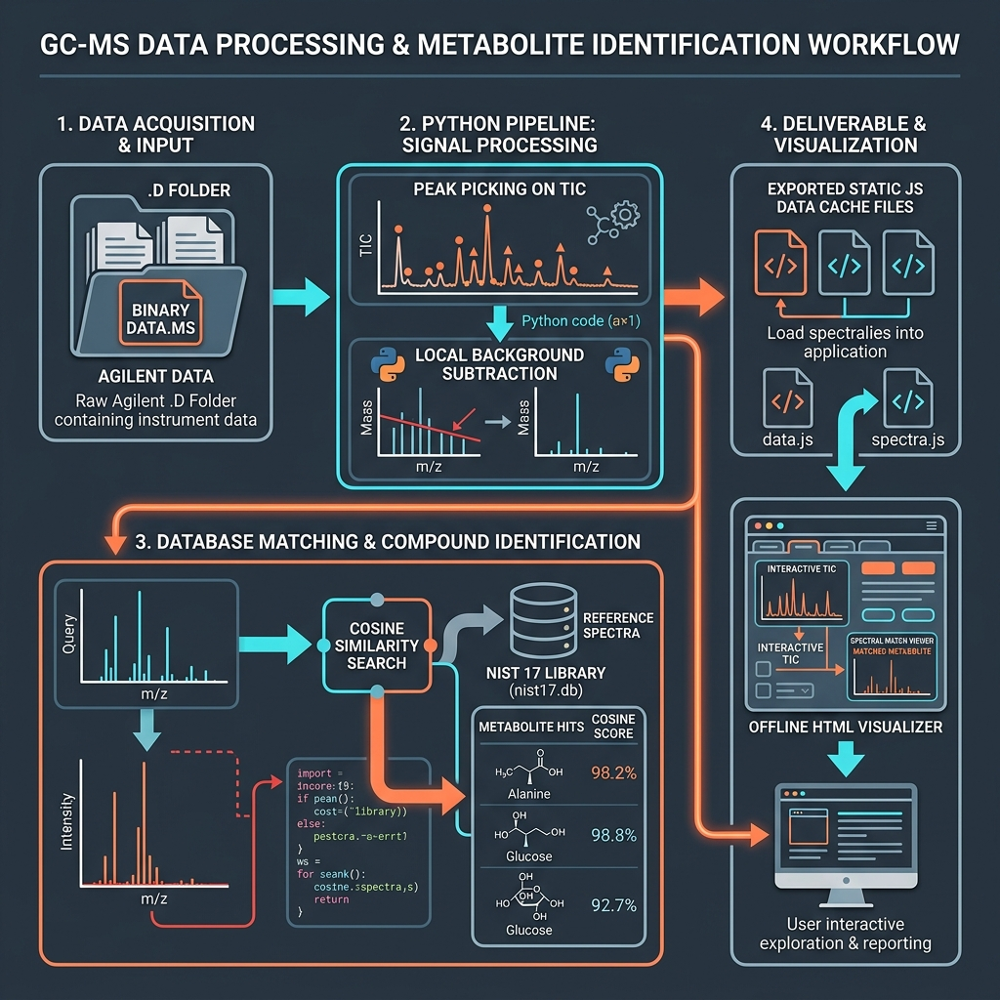

# 🔬 GC-MS Qualitative Evidence Reviewer

[](https://davinson-pezo.github.io/visualizer-gc-ms/)
[](#-spectral-library--compilation)
[](https://plotly.com/javascript/)
[](#-technical-notes)
[](#)

Custom HTML visualizer for qualitative review of GC-MS samples processed in this private project.

This repository is a static, reproducible, easy-to-open viewer for reviewing chromatograms, raw experimental EI spectra (with local background subtraction), and head-to-tail comparative mirror plots against library records.

---

## 📈 Identification Workflow



The workflow processes raw Agilent ChemStation `.D` data and matches extracted spectra against the NIST 17 reference database. The Python pipeline automates peak picking, background subtraction, and similarity scoring, exporting lightweight JS cache files for the visualizer. The source for this infographic is located in `assets/identification_workflow_infographic.png`.

---

## 📚 Spectral Library & Compilation

The visualizer's sample data is matched and annotated using the project's reference database:

```
Agilent DATA.MS raw scan (m/z 50 - 400)
  |
  +--> Python Pipeline:
  |      |
  |      +--> PDF-guided alignment (exact RT extraction & CAS normalization)
  |      |     OR
  |      +--> Automated peak picking (10,000 threshold for Blank and Alkanes)
  |      |
  |      +--> Local background subtraction (+/- 20 scan window)
  |
  +--> Cosine Similarity Search (NIST dot-product formula)
  |      |
  │      +--> Database: NIST 17 reference library (nist17.db SQLite)
```

### Search Constraints:
* **Tolerances:** Mass tolerance is set to $\pm 0.5$ Da for fragment alignment.
* **Pre-filtering:** Uses the top 6 peaks of the query spectrum against library base peaks, with a safety rule allowing matching for database entries whose base peak falls below the scanned range ($< 50.0$ m/z).
* **Scoring:** Normalized cosine dot-product on a scale of 0 to 1000.

---

## 🚀 Open the Visualizer

You can access the live visualizer online or run it locally:

### 🌐 Live Deployment
👉 **[Open Live Visualizer Website](https://davinson-pezo.github.io/visualizer-gc-ms/)**

### 💻 Opening it locally (No Server Required):
1. Navigate to the `visualizer/` folder.
2. **Double-click `index.html`** or drag it into Chrome, Safari, Firefox, or Edge.
3. The visualizer will load the processed data from `data/*.js` and Plotly from `vendor/`.

*Note: Bypasses CORS browser blockages on the `file://` protocol by using dynamic script tag injection in `app.js` instead of `fetch()` requests. No Python or local server is required to view results.*

---

## 🧪 Included Samples

The visualizer contains processed data from ten sequences:

* **Blank** (`250804_BK_empty`): Control run of the empty capillary column (68 peaks detected with $1.0 \times 10^4$ threshold).
* **Alkanes Standard** (`20260518_Alkanes_C8_C24_3`): Calibration standard containing C8-C24 alkanes for Retention Index calculation (210 peaks detected with $1.0 \times 10^4$ threshold).
* **Barley Powder** (`250812_barley_powder`): Barley biomass profiling (174 peaks aligned with PDF, including key volatile markers like $\beta$-ionone and loliolide).
* **CMC Controls** (`250813_CMC_BK`, `250814_CMC_BW`, `250815_CMC_BE`, `250816_CMC_BWE`): Carboxymethyl cellulose blanks and system controls (aligned with PDF).
* **Polar Extracts** (`250817_extract_EW_100uL`, `250817_extract_E_100uL`, `250817_extract_W_100uL`): Ethanol-water, ethanol, and water solvent extraction profiles (aligned with PDF).

### Experimental Conditions:
* **Chromatography**: Capillary GC method utilizing a polar stationary phase column.
* **Detector**: Agilent MSD (Electron Ionization operating at standard **70 eV**).
* **Mass Range**: Scanning nominal m/z values in the range of **50 to 400 m/z**.

---

## ⚖️ Match Factor Scale

The similarity score (Match Factor, $MF$) represents the quality of the spectral correlation:

| Score | Match Quality | Interpretation |
| :---: | :--- | :--- |
| **> 900** | Excellent | Highly confident compound identification |
| **800 - 900** | Good | Very likely compound identification |
| **700 - 800** | Moderate | Likely compound identification |
| **< 700** | Low | Similar structural isomers or high spectral noise |

The visualizer shows the best library match (name, formula, CAS, MW, RI, and score) inside the active card, with quick link buttons for **PubChem**, **NIST WebBook**, and **ChemSpider** databases.
